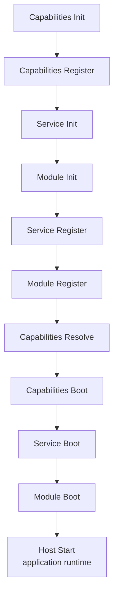

Runa uses one lifecycle to orchestrate installed capabilities, business Modules, Services, and Host units. Framework capabilities and business modules go through the same sequence, so startup and shutdown are predictable.

## Application startup order

```text
Init -> Register -> Resolve -> Boot -> Shutdown
```

Installed capabilities, Services, and Modules all go through lifecycle stages. Capabilities run first, and Modules run after capability registration is complete.

| Stage | Best for |
| --- | --- |
| Init | Register DI objects and prepare default instances |
| Register | Read config, register commands, Host units, routes, and route services |
| Resolve | Resolve delayed mount relationships such as route groups/domains |
| Boot | Final preparation before startup, opening connections or finishing runtime initialization |
| Shutdown | Release resources, close drivers, connections, and background tasks |

Provider and Module both have lifecycle methods, but their signatures differ. Provider `Register(ctx)` receives `provider.Context`; Module `Register(ctx, app)` also receives the standard `context.Context`. Business code usually writes Module, while framework capabilities and reusable extensions write Provider.

`Resolve` is optional and only applies to Providers that implement Resolver. It is useful for delayed mounts, for example collecting route groups/domains first and resolving them after all modules are registered.

Actual startup order:



`Host Start` begins the application runtime. It is not a lifecycle method on Provider or Module.

## Init

Init is a good place to register service objects used by later stages in the same module:

```go
func (UserModule) Init(ctx context.Context, app provider.Context) error {
    provider.ProvideDefault(app, func(do.Injector) (*Registry, error) {
        return New(), nil
    })
    return nil
}
```

## Register

Register is a good place to read config and register features:

```go
func (UserModule) Register(ctx context.Context, app provider.Context) error {
    registry := provider.MustInvoke[*Registry](app)
    registry.Register("default")
    return app.RegisterCommand(MyCommand{})
}
```

Module can also register commands during `Register`:

```go
func (UserModule) Register(ctx context.Context, app provider.Context) error {
    route.Default().Get("/users", listUsers)
    return app.RegisterCommand(UserSyncCommand{})
}
```

## Boot

Boot is for preparation that requires all capabilities and modules to have completed registration. Regular business modules usually do not need Boot.

```go
func (UserModule) Boot(ctx context.Context, app provider.Context) error {
    return nil
}
```

## Shutdown

The application shuts down everything in reverse order. If an object registered in DI implements:

```go
func (x *Registry) Shutdown(ctx context.Context) error
```

it will be called when the DI container closes.

## Host

HTTP services, queue workers, and WebSocket hubs can all be mounted as Host units. `Run` defaults to the `serve` command, `serve` starts every registered Host unit, and `Shutdown` stops them in reverse order.

For normal HTTP apps, you usually do not register a Host manually. `route.Provider(...)` handles the HTTP Host.

Queue workers do not start automatically just because `queue.Provider(...)` is installed. Start workers with `queue:work workerName`, or call `RegisterHost(queue.NewUnit(...))` from a Module when you intentionally want workers to run with `serve`.

## Notes when writing Module

- Do not assume every capability's `Default()` is available after `Install` but before `Run` or `Freeze`; only a few capabilities prepare default objects early.
- Configure child packages through Provider options or config files whenever possible.
- Put business routes, commands, and tasks in the Module `Register` stage.
- Do not manually `New` objects everywhere and store them in globals; let Provider and DI manage lifecycle.
