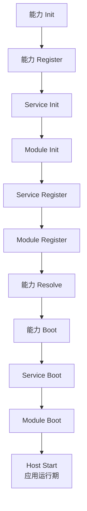

Runa 使用统一生命周期编排安装进来的能力、业务 Module、Service 和 Host。框架能力和业务模块都走同一套顺序，应用启动和关闭可预测。

## 应用按什么顺序启动

生命周期阶段是：

```text
Init -> Register -> Resolve -> Boot -> Shutdown
```

可以把它理解成：先准备对象，再注册功能，再解析延迟关系，再启动前初始化，最后反向关闭。

| 阶段 | 适合做什么 |
| --- | --- |
| Init | 注册 DI 对象、准备默认实例 |
| Register | 读取配置、注册命令、注册 Host、注册路由、注册路由服务 |
| Resolve | 解析延迟挂载关系，比如路由 group/domain |
| Boot | 启动前准备，打开连接或完成运行时初始化 |
| Shutdown | 释放资源，关闭驱动、连接和后台任务 |

Provider 和 Module 都有生命周期，但方法签名不同。业务代码通常写 Module，框架能力和可复用扩展才写 Provider。

`Resolve` 是可选阶段，只对实现 Resolver 的 Provider 生效。它适合处理延迟挂载关系，例如先收集 route group/domain，等所有模块注册完成后再统一解析。

实际启动顺序是：



`Host Start` 是应用运行期的开始，不是 Provider 或 Module 自身的生命周期方法。

## Init

Init 适合注册可被本模块其他阶段使用的服务对象：

```go
func (UserModule) Init(ctx context.Context, app provider.Context) error {
    provider.ProvideDefault(app, func(do.Injector) (*Registry, error) {
        return &Registry{}, nil
    })
    return nil
}
```

如果你刚开始使用 Runa，很多业务模块可以先不写 `Init`，只写 `Register`。

## Register

Register 适合读取配置并注册功能：

```go
func (UserModule) Register(ctx context.Context, app provider.Context) error {
    registry := provider.MustInvoke[*Registry](app)
    registry.Register("default")
    return app.RegisterCommand(MyCommand{})
}
```

Module 也可以在 `Register` 阶段注册路由和命令：

```go
func (UserModule) Register(ctx context.Context, app provider.Context) error {
    route.Default().Get("/users", listUsers)
    return app.RegisterCommand(UserSyncCommand{})
}
```

## Boot

Boot 适合做需要所有能力和模块都完成注册后的准备工作。普通业务模块通常不需要实现 Boot。

```go
func (UserModule) Boot(ctx context.Context, app provider.Context) error {
    return nil
}
```

## Shutdown

应用关闭时会反向执行 Shutdown。业务模块需要释放自己持有的资源时，可以实现：

```go
func (UserModule) Shutdown(ctx context.Context, app provider.Context) error {
    return nil
}
```

注册进 DI 的对象如果实现下面的方法，DI 容器关闭时也会调用它：

```go
func (x *Registry) Shutdown(ctx context.Context) error
```

## Host

HTTP 服务、队列 worker、WebSocket hub 都可以作为 Host 挂到应用。应用 `Run` 默认执行 `serve`，`serve` 会启动所有已注册 Host，`Shutdown` 时再反向停止。

普通 HTTP 应用里，你通常不需要手动注册 Host，`route.Provider(...)` 会处理 HTTP Host。

队列 worker 不会因为安装了 `queue.Provider(...)` 就自动跟着 `Run` 启动。你可以用 `queue:work workerName` 单独启动 worker，也可以在 Module 里调用 `RegisterHost(queue.NewUnit(...))` 让它跟随 `serve` 一起启动。

## 写 Module 时要注意什么

- 不要在 `Install` 后、`Run` 或 `Freeze` 前假设所有能力的 `Default()` 都已可用，只有少数能力会在安装时提前准备默认对象
- 需要配置子包时，优先通过 Provider option 或配置文件完成
- 业务路由、业务命令和业务任务优先放在 Module 的 `Register` 阶段
- 不要在业务代码里到处手动 `New` 后再塞全局变量，应该让 Provider 和 DI 管理生命周期

## 常见错误

### 在包级变量里读取 Default

不要这样写：

```go
var store = cache.Default().MustOf[string]("default")
```

这段代码会在应用生命周期之前执行，容易读不到 DI 对象。应该在 handler、命令或生命周期方法里读取。

### 把连接初始化写在 main.go 里

如果连接属于某个能力，优先让能力 Provider 管理。如果连接是业务自己的资源，可以放进 Module 的 `Init` 或 `Boot`，并在 `Shutdown` 里关闭。
